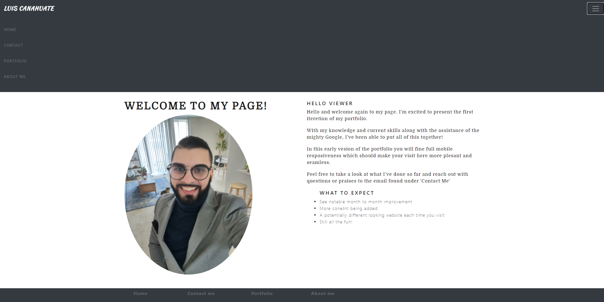

# Luis Canahuate Portfolio

## Link
 Website link: https://canahuate16.github.io/

## Description: 
This is my personal portfolio where the latest projects I have created will be showcased. Additional information regarding my skills and current abilities and a brief about me page. This is a live product that will be changing as I learn new technologies and become a more advanced programmer.

## Tech/framework use
Bootstrap, HTML5, CSS3, (JavaScript, jQuery, JSON on portfolio links )

## Features
Fully responsive in all devices, link to downloable resume and to github pages/repository. 

## Website Image

## License
Copyright (C) 2011 - 2020 Olivier Biot

Permission is hereby granted, free of charge, to any person obtaining a copy of
this software and associated documentation files (the "Software"), to deal in
the Software without restriction, including without limitation the rights to
